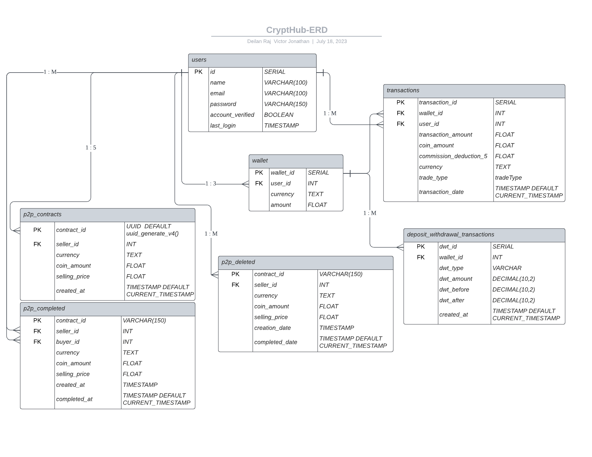
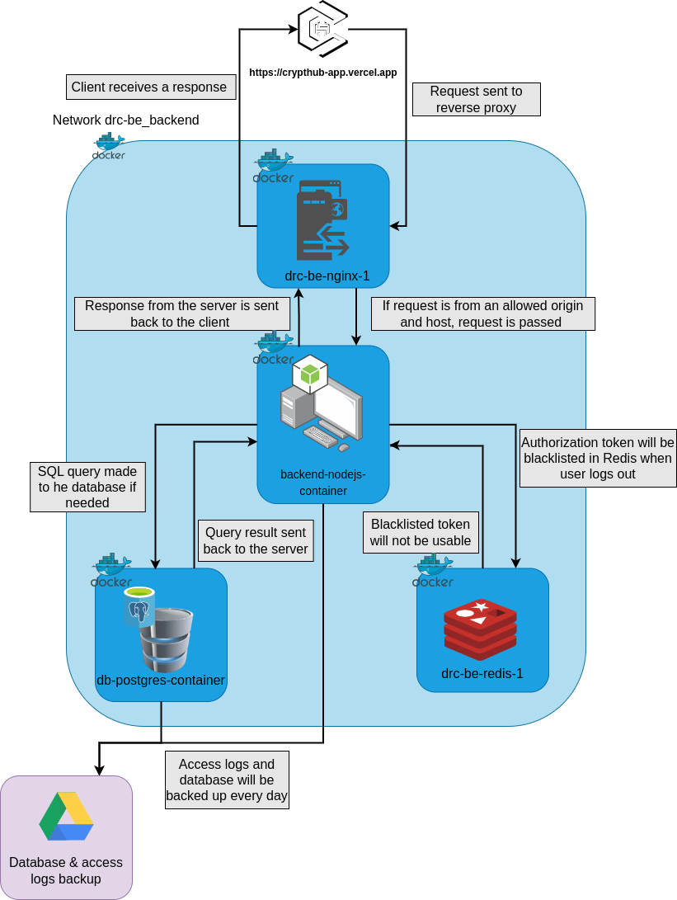

# DRC-BE component

Back-end server for [Crypthub](https://crypthub-app.vercel.app). A crypto trading platform which offers two main services which is a Peer-to-Peer (P2P) marketplace and a real-time trading market.

# Table of Content

- [Crypthub Server](#crypthub-server)
  - [Entity Relational Diagram](#crypthub-entity-relational-diagram-erd)
  - [Server components](#server-components)
  - [Backend System Flow](#crypthub-backend-system-flow)
  - [Scripts](#scripts)
    - [clearUnusedImages.sh](#clearunusedimagessh)
    - [initialSetup.sh](#initialsetupsh)
    - [update.sh](#updatesh)
  - [Port Configuration](#ports)
- [API](#apis-application-programming-interfaces)

# Crypthub Server

## Crypthub Entity Relational Diagram (ERD)



- Tables in ERD consists of:
  - users
  - wallet
  - transactions
  - deposit_withdrawal_transactions
  - p2p_contracts
  - p2p_completed
  - p2p_deleted

## Server components:

- [Nodejs](https://nodejs.org/en): A runtime environment for executing JavaScript code on the server-side, providing an event-driven, non-blocking I/O model that enables scalable and efficient server-side applications.
- [PostgresDB](https://www.postgresql.org/): A powerful and feature-rich open-source relational database management system that provides data persistence and advanced SQL querying capabilities.
- [Redis](https://redis.io/): An in-memory data structure store that can be used as a database, cache, or message broker. It offers fast and efficient data access and supports various data structures and operations.

- [Nginx](https://www.nginx.com/): A high-performance web server and reverse proxy server that excels at serving static content, handling high traffic loads, and efficiently distributing incoming requests to backend servers.

### **Crypthub Backend System Flow**



## Scripts:

### `clearUnusedImages.sh`:

- The script is used to remove unused docker images for maintainence.

```bash
#!/bin/bash

cd ../DRC-BE/

#shut down docker containers
docker compose down --volumes &&

# remove any unused images
# Get the image IDs
unused_image_ids=$(docker images |grep none| awk '{print $3}')
# Counter for removed images
removed=0
# Loop through the image IDs and remove the images
for id in $unused_image_ids; do
    docker rmi $id &&
    removed=$((removed + 1)) &&
    if [ $unused_image_ids -eq 0 ]; then
        break
    fi &&
done &&
echo "Images removed: $removed"
```

### `initialSetup.sh`:

- Run this script during the initial setup. Similar to the [update.sh](#updatesh).

```bash
#!/bin/bash

# pull the updates
error_message="Please make sure you have the correct access rights and the repository exists."
success_message="Already up to date."


cd /root/DRC-BE/
eval "$(ssh-agent -s)" && ssh-add [path to private key] &&
pull_command=$(git pull origin main) &&
echo "In $(pwd)"
if echo "$pull_command" | grep -q "$error_message"; then
        eval "$(ssh-agent -s)" && ssh-add [path to private key] && ssh-add -l &&
        $pull_command
        exit 1
elif echo "$pull_command" | grep -q "$success_message"; then
        echo "Pull successful"
fi

# install dependencies
npm i && cd app/ && npm i && cd ..

# stop and remove containers
docker compose down --volumes &&

# start the containers
docker compose up --build -d &&

# run the data back up script
export OPENSSL_CONF=/dev/null &&
echo "cron running.."
node cronBackup.js
```

### `update.sh`:

- This script will be executed automatically every Friday @ 00:00 using cron jobs for the purpose of pulling latest updates.
- The script will first stop and remove all the containers, activate the ssh agent and add the private key, pull the latests changes from Github, install dependencies, start the container as well as execute the `cronBackup.js`

```bash
#!/bin/bash
# Script is run when there is an update in the main while the server is running
cd /root/DRC-BE/

# stops all the running containers
running_containers=(add container names)

for container in "${running_containers[@]}"; do
    docker stop "$container"
    echo "$container stopped"
done && echo "All containers stopped successfully" &&

# down the containers
docker compose down --volumes &&

# pull the updates
error_message="Please make sure you have the correct access rights and the repository exists."
success_message="Already up to date."

eval "$(ssh-agent -s)" && ssh-add [path to private key] &&
pull_command=$(git pull origin main) &&
echo "In $(pwd)"
if echo "$pull_command" | grep -q "$error_message"; then
        eval "$(ssh-agent -s)" && ssh-add [path to private key] && ssh-add -l &&
        $pull_command
        exit 1
elif echo "$pull_command" | grep -q "$success_message"; then
        echo "Pull successful"
fi

# install dependencies
cd /root/DRC-BE/app/ && npm i && cd ..

# run the containers
docker compose up --build -d &&

# run the data back up script
export OPENSSL_CONF=/dev/null &&
echo "cron running.."
node cronBackup.js

```

## Port Configuration:

If error appears such as this: <br>
`listen tcp4 0.0.0.0:[PORT]: bind: address already in use.` <br>
Resolve the issue by using the follwoing commands:

- `sudo lsof -i:[PORT]`:
  - Run to see if there are anything running on the port.
- `sudo kill -9 [PID]`:
  - Run to kill anything with the given PID running on the port <br>

# APIs (Application Programming Interfaces)

Below is the list of APIs that the client website uses:

## User API Endpoints

#### Register new users

- **Endpoint:** `/registerUser`
- **Method:** POST
- **Description:** Registers new users
- **Request:** `{name, email, password}`
- **Response:**

```json
{
  "message": "USER_CREATED"
}
```

#### Login new users

- **Endpoint:** `/loginUser`
- **Method:** POST
- **Description:** Logs in verified users
- **Request:** `{email, password}`
- **Response:**

```json
{
  "message": "LOGIN_SUCCESSFUL",
  "details": {
    "token": "",
    "id": 2,
    "name": "deilan",
    "email": "deilanraj9799@gmail.com",
    "USD": 0,
    "BTC": 0,
    "ETH": 0
  }
}
```

#### Password Forgot (Forgot Password)

- **Endpoint:** `/forgotPassword`
- **Method:** POST
- **Description:** Resets user's password
- **Request:** `{email}`
- **Response:**

```json
{
  "message": "EMAIL_SENT"
}
```

**NOTE: ONCE THE EMAIL LINK HAS BEEN CLICK, ANOTHER RESPONSE WILL BE SENT**

```json
{
  "message": "SEND_NEW_PASSWORD_TO_USER"
}
```

#### Password Reset (Reset Password)

- **Endpoint:** `/resetPassword`
- **Method:** POST
- **Description:** Resets user's password
- **Request:** `{old_password, new_password}`
- **Response:**

```json
{
  "message": "RESET_PASSWORD_SUCCESS"
}
```

#### Logout users

- **Endpoint:** `/logoutUser`
- **Method:** POST
- **Description:** Logs out users
- **Response:**

```json
{
  "message": "LOGOUT_SUCCESS"
}
```

#### Checks blacklist for tokens

- **Endpoint:** `/checkBlacklist`
- **Method:** POST
- **Description:** Checks the cache for blacklisted authorization tokens
- **Response:**

```json
{
  "message": "TOKEN_IS_BLACKLISTED"
}
```

#### Verifies account

- **Endpoint:** `/verify/:token`
- **Method:** GET
- **Description:** Checks if the token in the URL is the same as the one generated by the server

## Trade API Endpoints

#### Buy crypto, ETH or BTC

- **Endpoint:** `/buy`
- **Method:** POST
- **Description:** Users buy either ETH or BTC coins using their virtual USD
- **Request:** `{coin_currency, current_price, coin_amount, request_header}`
- **Response:**

```json
{
  "message": "BUY_ORDER_SUCCESS",
  "details": {
    "coinCurrency": "BTC",
    "walletBalance": {
      "USD": 7254.49,
      "BTC": 1.4186936699999995,
      "ETH": 0
    }
  }
}
```

#### Sell crypto, ETH or BTC

- **Endpoint:** `/sell`
- **Method:** POST
- **Description:** Users sell their own ETH or BTC and earn virtual USD
- **Request:** `{coin_currency, current_selling_price, coin_amount, request_header}`
- **Response:**

```json
{
  "message": "SELL_ORDER_SUCCESS",
  "details": {
    "coinCurrency": "ETH",
    "walletBalance": {
      "BTC": 0.9751948447414551,
      "ETH": 13.559141073176196,
      "USD": 1824.38
    }
  }
}
```

## Wallet API Endpoints

#### Deposit money into USD wallet

- **Endpoint:** `/walletDeposit`
- **Method:** POST
- **Description:** Users can deposit any amount into the wallet
- **Request:** `{request_header, amount}`
- **Response:**

```json
{
  "message": "DEPOSIT_SUCCESS",
  "details": {
    "balance": 60000
  }
}
```

#### Withdraw money from USD wallet

- **Endpoint:** `/walletWithdraw`
- **Method:** POST
- **Description:** Users can withdraw any amount from the wallet
- **Request:** `{request_header, amount}`
- **Response:** Similar to [deposit](#deposit-money-into-usd-wallet)

#### Get wallet transaction history

- **Endpoint:** `/walletTransaction`
- **Method:** GET
- **Description:** Retrieves all of user's deposit and withdrawal history
- **Request:** Req.headers

```json
{
  "message": "SUCCESS",
  "details": {
    "balance": 60000
  }
}
```

#### Get wallet balance

- **Endpoint:** `/currentWalletBalance`
- **Method:** GET
- **Description:** Returns the current wallet balance
- **Request:** Req.headers

## Transaction API Endpoints

#### Get all buy and sell transactions

- **Endpoint:** `/getAllTransactions`
- **Method:** GET
- **Description:** Retrieve all the buy and sell orders
- **Request:** Request.headers

## P2P API Endpoints

#### Create a new P2P contract

- **Endpoint:** `/addP2PContract`
- **Method:** POST
- **Description:** Creates a new P2P contract and adds it in the database
- **Request:** `{currency, coin_amount, selling_price}`, Req.headers
- **Response:**

```json
{
  "message": "CONTRACT_ADDED",
  "details": {
    "wallet_balance": {
      "USD": 52586.13,
      "BTC": 0.07570000000000002,
      "ETH": 0
    }
  }
}
```

#### Buy P2P contract

- **Endpoint:** `/buyContract`
- **Method:** POST
- **Description:** Buy a P2P contract
- **Request:** `{contract_id}`, Req.headers
- **Response:**

```json
{
  "message": "CONTRACT_PURCHASE_SUCCESFUL",
  "details": {
    "USD": 38586.13,
    "BTC": 0.08020000000000002,
    "ETH": 0
  }
}
```

#### Delete P2P contract

- **Endpoint:** `/deleteContract`
- **Method:** POST
- **Description:** Delete a P2P contract
- **Request:** `{contract_id}`, Req.headers
- **Response:**

```json
{
  "message": "CONTRACT_DELETED",
  "details": {
    "USD": 51586.13,
    "BTC": 0.08230000000000001,
    "ETH": 0
  }
}
```

#### Get all P2P contracts for marketplace

- **Endpoint:** `/getOpenContracts`
- **Method:** GET
- **Description:** Retrieves all the open P2P contracts
- **Response:**

```json
{
  "message": "SUCCESS",
  "details": [
    {
      "contract_id": "b1b28720-3983-4501-a2cc-42f8ca08b5cd",
      "seller_id": 1,
      "currency": "BTC",
      "coin_amount": 0.0045,
      "selling_price": 14000,
      "created_at": "2023-07-14T03:36:02.011Z"
    },
    {
      "contract_id": "14799ba3-1bfc-479b-b938-b59e6e0feb08",
      "seller_id": 2,
      "currency": "BTC",
      "coin_amount": 0.0066,
      "selling_price": 1000,
      "created_at": "2023-07-14T03:36:09.598Z"
    }
  ]
}
```

#### Get ongoing P2P contracts of the user

- **Endpoint:** `/getOngoingContracts`
- **Method:** GET
- **Description:** Retrieves the open P2P contracts for a specific user
- **Request:** Req.headers
- **Response:**

```json
{
  "message": "SUCCESS",
  "details": [
    {
      "contract_id": "99c20d0b-5882-4d4c-b43d-3addcfed0d1e",
      "seller_id": 2,
      "currency": "BTC",
      "coin_amount": 0.0066,
      "selling_price": 1000,
      "created_at": "2023-07-14T03:29:58.403Z"
    }
  ]
}
```

#### Get all completed contracts based on the userID

- **Endpoint:** `/getCompletedContracts`
- **Method:** GET
- **Description:** Retrieves all the bought, sold, and deleted contracts for a specific user
- **Request:** Req.headers
- **Response:**

```json
{
  "message": "SUCCESS",
  "details": [
    {
      "contract_id": "b1b28720-3983-4501-a2cc-42f8ca08b5cd",
      "seller_id": 1,
      "currency": "BTC",
      "coin_amount": 0.0045,
      "selling_price": 14000,
      "created_at": "2023-07-14T03:36:02.011Z",
      "completed_at": "2023-07-14T03:37:38.670Z",
      "transaction_type": "bought"
    },
    {
      "contract_id": "3d81d8af-0e2c-49e8-9960-05bd115a1e1b",
      "seller_id": 2,
      "currency": "BTC",
      "coin_amount": 0.0066,
      "selling_price": 1000,
      "created_at": "2023-07-14T03:33:38.953Z",
      "completed_at": "2023-07-14T03:34:25.099Z",
      "transaction_type": "delete"
    },
    {
      "contract_id": "99c20d0b-5882-4d4c-b43d-3addcfed0d1e",
      "seller_id": 2,
      "currency": "BTC",
      "coin_amount": 0.0066,
      "selling_price": 1000,
      "created_at": "2023-07-14T03:29:58.403Z",
      "completed_at": "2023-07-14T03:32:10.718Z",
      "transaction_type": "sold"
    }
  ]
}
```

Please refer to the documentation for detailed information on each API endpoint and their usage.
