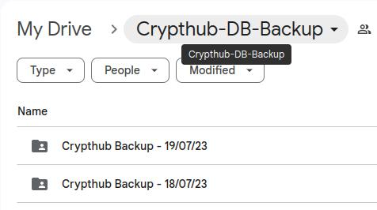
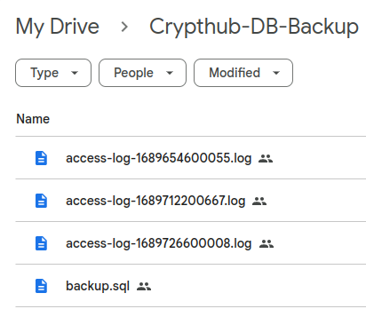

# DRC-BE component

Back-end server for [Crypthub](https://crypthub-app.vercel.app). A crypto trading platform which offers two main services which is a Peer-to-Peer (P2P) marketplace and a real-time trading market.

# Table of Content

- [Crypthub Server](#crypthub-server)
  - [Entity Relational Diagram](#crypthub-entity-relational-diagram-erd)
  - [Server components](#server-components)
  - [Backend System Flow](#crypthub-backend-system-flow)
  - [Scripts](#scripts)
    - [clearUnusedImages.sh](#clearunusedimagessh)
    - [initialSetup.sh](#initialsetupsh)
    - [update.sh](#updatesh)
  - [Port Configuration](#ports)
- [API](#apis-application-programming-interfaces)

# Crypthub Server

## Crypthub Entity Relational Diagram (ERD)


- Tables in ERD consists of:
  - users
  - wallet
  - transactions
  - deposit_withdrawal_transactions
  - p2p_contracts
  - p2p_completed
  - p2p_deleted

## Server components:

- [Nodejs](https://nodejs.org/en): A runtime environment for executing JavaScript code on the server-side, providing an event-driven, non-blocking I/O model that enables scalable and efficient server-side applications.
- [PostgresDB](https://www.postgresql.org/): A powerful and feature-rich open-source relational database management system that provides data persistence and advanced SQL querying capabilities.
- [Redis](https://redis.io/): An in-memory data structure store that can be used as a database, cache, or message broker. It offers fast and efficient data access and supports various data structures and operations.

- [Nginx](https://www.nginx.com/): A high-performance web server and reverse proxy server that excels at serving static content, handling high traffic loads, and efficiently distributing incoming requests to backend servers.

- [Docker](https://www.docker.com/): Docker is an open-source platform that enables developers to automate application deployment and management using containers. Containers are lightweight, isolated environments that package applications and their dependencies, providing consistent and portable execution across different machines. Docker offers benefits such as portability, scalability, efficiency, and isolation, making it easier to develop, deploy, and manage applications.

### **Crypthub Backend System Flow**


## Scripts:

### `clearUnusedImages.sh`:

- The script is used to remove unused docker images for maintenance.

```bash
#!/bin/bash

cd ../DRC-BE/

#shut down docker containers
docker compose down --volumes &&

# remove any unused images
# Get the image IDs
unused_image_ids=$(docker images |grep none| awk '{print $3}')
# Counter for removed images
removed=0
# Loop through the image IDs and remove the images
for id in $unused_image_ids; do
    docker rmi $id &&
    removed=$((removed + 1)) &&
    if [ $unused_image_ids -eq 0 ]; then
        break
    fi &&
done &&
echo "Images removed: $removed"
```

### `initialSetup.sh`:

- Run this script during the initial setup. Similar to the [update.sh](#updatesh).

```bash
#!/bin/bash

# pull the updates
error_message="Please make sure you have the correct access rights and the repository exists."
success_message="Already up to date."


cd /root/DRC-BE/
eval "$(ssh-agent -s)" && ssh-add [path to private key] &&
pull_command=$(git pull origin main) &&
echo "In $(pwd)"
if echo "$pull_command" | grep -q "$error_message"; then
        eval "$(ssh-agent -s)" && ssh-add [path to private key] && ssh-add -l &&
        $pull_command
        exit 1
elif echo "$pull_command" | grep -q "$success_message"; then
        echo "Pull successful"
fi

# install dependencies
npm i && cd app/ && npm i && cd ..

# stop and remove containers
docker compose down --volumes &&

# start the containers
docker compose up --build -d &&

# run the data back up script
export OPENSSL_CONF=/dev/null &&
echo "cron running.."
node cronBackup.js
```

### `update.sh`:

- This script will be executed automatically every Friday @ 00:00 using cron jobs for the purpose of pulling latest updates.
- The script will first stop and remove all the containers, activate the ssh agent and add the private key, pull the latests changes from Github, install dependencies, start the container as well as execute the `cronBackup.js`

```bash
#!/bin/bash
# Script is run when there is an update in the main while the server is running
cd /root/DRC-BE/

# stops all the running containers
running_containers=(add container names)

for container in "${running_containers[@]}"; do
    docker stop "$container"
    echo "$container stopped"
done && echo "All containers stopped successfully" &&

# down the containers
docker compose down --volumes &&

# pull the updates
error_message="Please make sure you have the correct access rights and the repository exists."
success_message="Already up to date."

eval "$(ssh-agent -s)" && ssh-add [path to private key] &&
pull_command=$(git pull origin main) &&
echo "In $(pwd)"
if echo "$pull_command" | grep -q "$error_message"; then
        eval "$(ssh-agent -s)" && ssh-add [path to private key] && ssh-add -l &&
        $pull_command
        exit 1
elif echo "$pull_command" | grep -q "$success_message"; then
        echo "Pull successful"
fi

# install dependencies
cd /root/DRC-BE/app/ && npm i && cd ..

# run the containers
docker compose up --build -d &&

# run the data back up script
export OPENSSL_CONF=/dev/null &&
echo "cron running.."
node cronBackup.js

```

## Port Configuration:

If error appears such as this: <br>
`listen tcp4 0.0.0.0:[PORT]: bind: address already in use.` <br>
Resolve the issue by using the follwoing commands:

- `sudo lsof -i:[PORT]`:
  - Run to see if there are anything running on the port.
- `sudo kill -9 [PID]`:
  - Run to kill anything with the given PID running on the port <br>

# APIs (Application Programming Interfaces)

Below is the list of APIs that the client website uses:

## User API Endpoints

#### Register new users

- **Endpoint:** `user/registerUser`
- **Method:** POST
- **Description:** Registers new users
- **Request:** `{name, email, password}`
- **Response:**

```json
{
  "message": "USER_CREATED"
}
```

#### Login new users

- **Endpoint:** `user/loginUser`
- **Method:** POST
- **Description:** Logs in verified users
- **Request:** `{email, password}`
- **Response:**

```json
{
  "message": "LOGIN_SUCCESSFUL",
  "details": {
    "token": "",
    "id": 2,
    "name": "deilan",
    "email": "deilanraj9799@gmail.com",
    "USD": 0,
    "BTC": 0,
    "ETH": 0
  }
}
```

#### Password Forgot (Forgot Password)

- **Endpoint:** `user/forgotPassword`
- **Method:** POST
- **Description:** Resets user's password
- **Request:** `{email}`
- **Response:**

```json
{
  "message": "EMAIL_SENT"
}
```

**NOTE: ONCE THE EMAIL LINK HAS BEEN CLICK, ANOTHER RESPONSE WILL BE SENT**

```json
{
  "message": "SEND_NEW_PASSWORD_TO_USER"
}
```

#### Password Reset (Reset Password)

- **Endpoint:** `user/resetPassword`
- **Method:** POST
- **Description:** Resets user's password
- **Request:** `{old_password, new_password}`
- **Response:**

```json
{
  "message": "RESET_PASSWORD_SUCCESS"
}
```

#### Logout users

- **Endpoint:** `user/logoutUser`
- **Method:** POST
- **Description:** Logs out users
- **Response:**

```json
{
  "message": "LOGOUT_SUCCESS"
}
```

#### Checks blacklist for tokens

- **Endpoint:** `user/checkBlacklist`
- **Method:** POST
- **Description:** Checks the cache for blacklisted authorization tokens
- **Response:**

```json
{
  "message": "TOKEN_IS_BLACKLISTED"
}
```

#### Verifies account

- **Endpoint:** `/verify/:token`
- **Method:** GET
- **Description:** Checks if the token in the URL is the same as the one generated by the server

## Trade API Endpoints

#### Buy crypto, ETH or BTC

- **Endpoint:** `trade/buy`
- **Method:** POST
- **Description:** Users buy either ETH or BTC coins using their virtual USD
- **Request:** `{coin_currency, current_price, coin_amount, input_amount request_header}`
- **Response:**

```json
{
  "message": "BUY_ORDER_SUCCESS",
  "details": {
    "coinCurrency": "BTC",
    "walletBalance": {
      "USD": 7254.49,
      "BTC": 1.4186936699999995,
      "ETH": 0
    }
  }
}
```

#### Sell crypto, ETH or BTC

- **Endpoint:** `trade/sell`
- **Method:** POST
- **Description:** Users sell their own ETH or BTC and earn virtual USD
- **Request:** `{coin_currency, current_selling_price, coin_amount, request_header}`
- **Response:**

```json
{
  "message": "SELL_ORDER_SUCCESS",
  "details": {
    "coinCurrency": "ETH",
    "walletBalance": {
      "BTC": 0.9751948447414551,
      "ETH": 13.559141073176196,
      "USD": 1824.38
    }
  }
}
```

## Wallet API Endpoints

#### Deposit money into USD wallet

- **Endpoint:** `wallet/walletDeposit`
- **Method:** POST
- **Description:** Users can deposit any amount into the wallet
- **Request:** `{request_header, amount}`
- **Response:**

```json
{
  "message": "DEPOSIT_SUCCESS",
  "details": {
    "balance": 60000
  }
}
```

#### Withdraw money from USD wallet

- **Endpoint:** `wallet/walletWithdraw`
- **Method:** POST
- **Description:** Users can withdraw any amount from the wallet
- **Request:** `{request_header, amount}`
- **Response:**

```json
{
  "message": "WITHDRAW_SUCCESS",
  "details": {
    "balance": 9000
  }
}
```

#### Get wallet transaction history

- **Endpoint:** `wallet/walletTransaction`
- **Method:** GET
- **Description:** Retrieves all of user's deposit and withdrawal history
- **Request:** Req.headers
- **Response:**

```json
{
  "message": "SUCCESS",
  "details": [
    {
      "dwt_id": 2,
      "wallet_id": 1,
      "dwt_type": "withdraw",
      "dwt_amount": "1000.00",
      "dwt_before": "10000.00",
      "dwt_after": "9000.00",
      "created_at": "2023-07-19T04:31:57.776Z"
    },
    {
      "dwt_id": 1,
      "wallet_id": 1,
      "dwt_type": "deposit",
      "dwt_amount": "10000.00",
      "dwt_before": "0.00",
      "dwt_after": "10000.00",
      "created_at": "2023-07-19T04:23:13.979Z"
    }
  ]
}
```

#### Get wallet balance

- **Endpoint:** `wallet/currentWalletBalance`
- **Method:** GET
- **Description:** Returns the current wallet balance
- **Request:** Req.headers
- **Response:**

```json
{
  "message": "SUCCESS",
  "details": {
    "USD": 9000,
    "BTC": 0,
    "ETH": 0
  }
}
```

## Transaction API Endpoints

#### Get all buy and sell transactions

- **Endpoint:** `transaction/getAllTransactions`
- **Method:** GET
- **Description:** Retrieve all the buy and sell orders
- **Request:** Request.headers
- **Response:**

```json
{
  "message": "SUCCESS",
  "details": [
    {
      "transaction_id": 2,
      "wallet_id": 3,
      "user_id": 1,
      "transaction_amount": 9.5,
      "coin_amount": 1,
      "commission_deduction_5": 0.5,
      "currency": "ETH",
      "trade_type": "sell",
      "transaction_date": "2023-07-19T06:06:24.837Z"
    }
  ]
}
```

## P2P API Endpoints

#### Create a new P2P contract

- **Endpoint:** `/addP2PContract`
- **Method:** POST
- **Description:** Creates a new P2P contract and adds it in the database
- **Request:** `{currency, coin_amount, selling_price}`, Req.headers
- **Response:**

```json
{
  "message": "CONTRACT_ADDED",
  "details": {
    "wallet_balance": {
      "USD": 52586.13,
      "BTC": 0.07570000000000002,
      "ETH": 0
    }
  }
}
```

#### Buy P2P contract

- **Endpoint:** `/buyContract`
- **Method:** POST
- **Description:** Buy a P2P contract
- **Request:** `{contract_id}`, Req.headers
- **Response:**

```json
{
  "message": "CONTRACT_PURCHASE_SUCCESFUL",
  "details": {
    "USD": 38586.13,
    "BTC": 0.08020000000000002,
    "ETH": 0
  }
}
```

#### Delete P2P contract

- **Endpoint:** `/deleteContract`
- **Method:** POST
- **Description:** Delete a P2P contract
- **Request:** `{contract_id}`, Req.headers
- **Response:**

```json
{
  "message": "CONTRACT_DELETED",
  "details": {
    "USD": 51586.13,
    "BTC": 0.08230000000000001,
    "ETH": 0
  }
}
```

#### Get all P2P contracts for marketplace

- **Endpoint:** `/getOpenContracts`
- **Method:** GET
- **Description:** Retrieves all the open P2P contracts
- **Response:**

```json
{
  "message": "SUCCESS",
  "details": [
    {
      "contract_id": "b1b28720-3983-4501-a2cc-42f8ca08b5cd",
      "seller_id": 1,
      "currency": "BTC",
      "coin_amount": 0.0045,
      "selling_price": 14000,
      "created_at": "2023-07-14T03:36:02.011Z"
    },
    {
      "contract_id": "14799ba3-1bfc-479b-b938-b59e6e0feb08",
      "seller_id": 2,
      "currency": "BTC",
      "coin_amount": 0.0066,
      "selling_price": 1000,
      "created_at": "2023-07-14T03:36:09.598Z"
    }
  ]
}
```

#### Get ongoing P2P contracts of the user

- **Endpoint:** `/getOngoingContracts`
- **Method:** GET
- **Description:** Retrieves the open P2P contracts for a specific user
- **Request:** Req.headers
- **Response:**

```json
{
  "message": "SUCCESS",
  "details": [
    {
      "contract_id": "99c20d0b-5882-4d4c-b43d-3addcfed0d1e",
      "seller_id": 2,
      "currency": "BTC",
      "coin_amount": 0.0066,
      "selling_price": 1000,
      "created_at": "2023-07-14T03:29:58.403Z"
    }
  ]
}
```

#### Get all completed contracts based on the userID

- **Endpoint:** `/getCompletedContracts`
- **Method:** GET
- **Description:** Retrieves all the bought, sold, and deleted contracts for a specific user
- **Request:** Req.headers
- **Response:**

```json
{
  "message": "SUCCESS",
  "details": [
    {
      "contract_id": "b1b28720-3983-4501-a2cc-42f8ca08b5cd",
      "seller_id": 1,
      "currency": "BTC",
      "coin_amount": 0.0045,
      "selling_price": 14000,
      "created_at": "2023-07-14T03:36:02.011Z",
      "completed_at": "2023-07-14T03:37:38.670Z",
      "transaction_type": "bought"
    },
    {
      "contract_id": "3d81d8af-0e2c-49e8-9960-05bd115a1e1b",
      "seller_id": 2,
      "currency": "BTC",
      "coin_amount": 0.0066,
      "selling_price": 1000,
      "created_at": "2023-07-14T03:33:38.953Z",
      "completed_at": "2023-07-14T03:34:25.099Z",
      "transaction_type": "delete"
    },
    {
      "contract_id": "99c20d0b-5882-4d4c-b43d-3addcfed0d1e",
      "seller_id": 2,
      "currency": "BTC",
      "coin_amount": 0.0066,
      "selling_price": 1000,
      "created_at": "2023-07-14T03:29:58.403Z",
      "completed_at": "2023-07-14T03:32:10.718Z",
      "transaction_type": "sold"
    }
  ]
}
```

Please refer to the documentation for detailed information on each API endpoint and their usage.

# Project Dependencies

### googleapis

**Description:** This package allows the server to upload data into Google Drive to serve as a backup.

**Example of usage:**
```javascript
// Authorize the server to interact with Google API
const auth = new google.auth.JWT(
  crypthub_backup.client_email,
  null,
  crypthub_backup.private_key,
  ["https://www.googleapis.com/auth/drive"]
);
```

### node-cron

**Description:** This package enables the server to perform certain functionalities at scheduled intervals (e.g., every set seconds, minutes, hours, etc.).

**Example of usage:**
```javascript
// Backup the database every 24 hours
function cronBackup24hr() {
  const task = cron.schedule("0 0 0 * * *", () => {
    dumpDB();
    backupData();
  });
  task.start();
}
```

### bcrypt

**Description:** This package provides password hashing functionality to the server.

**Example of usage:**
```javascript
// Compare whether a password matches a hashed password
const matching = await bcrypt.compare(received_password, actual_password);
```

### body-parser

**Description:** This package allows parsing of incoming JSON data from the request body and adds the resulting JSON object to the `req.body` property.

**Example of usage:**
```javascript
// Parsing incoming JSON data
app.use(bodyParser.json());
```

### dotenv

**Description:** This package allows loading of environment variables from a `.env` file into the server's application `process.env` object.

**Example of usage:**
```javascript
// Accessing environment variables from process.env
const env = process.env;
```

### ejs

**Description:** This package enables the server to embed JavaScript code inside HTML templates for dynamic content generation.

**Example of usage:**
```javascript
// Setting ejs as the view engine
app.set("view engine", "ejs");
```
# Project Dependencies

### express

**Description:** This package allows the runtime environment for executing JavaScript outside of a web browser. It is a web application framework for Node.js.

**Example of usage:**
```javascript
// Creating an instance of Express.js application
const app = express();
```

### ioredis

**Description:** This package enables the server to work with Redis, an in-memory data store.

**Example of usage:**
```javascript
// Adding a token to the blacklist
function blacklist(logout_token) {
  redisClient.zadd("blacklisted", Date.now(), logout_token);
}
```

### jsonwebtoken

**Description:** This package allows the creation of tokens to securely transmit information between the client and the server. It is commonly used for user authentication and authorization.

**Example of usage:**
```javascript
// Create a token that holds user’s email and id that expires in 24 hours
let token = jwt.sign({ email: user_email, id: user_id }, env.SECRET_KEY, {
  expiresIn: "24h",
});
```

### nodemailer

**Description:** This package allows the server to send email messages.

**Example of usage:**
```javascript
// Setting up the sender’s (server) information to send email using Gmail as a service
const transporter = nodemailer.createTransport({
  service: "gmail",
  auth: {
    user: env.GOOGLE_EMAIL,
    pass: env.GOOGLE_PASSWORD,
  },
});
```

### pg

**Description:** This package allows the server to interact with PostgreSQL, a relational database.

**Example of usage:**
```javascript
// Connecting the Node.js container with the PostgreSQL container
import pg from "pg";
const { Pool } = pg;
import config from "../app_config.js";
const db_config = config.db;
const connectionString =
  "postgresql://" +
  db_config.user +
  ":" +
  db_config.password +
  "@" +
  db_config.host +
  ":" +
  db_config.port +
  "/" +
  db_config.database;
const pool = new Pool({ connectionString });
```

### morgan

**Description:** This package allows logging of incoming HTTP requests and responses in the application.

**Example of usage:**
```javascript
// Show incoming requests in the console
app.use(morgan('dev'));
```

### nodemon

**Description:** This package automatically restarts the `server.js` application whenever changes are detected in the source code. 


Please make sure to install these packages as dependencies using npm or yarn before running the application. You can find more information about each package in their respective documentation. 

# Backup Functionality

The server is equipped with an automated backup feature that securely stores essential data in Google Drive. This process involves creating a folder named "Crypthub Backup - {current date}"



Organizing all relevant data inside this folder.



The backed-up data includes the following details:

1. **PostgreSQL Backup** - `backup.sql`:
   - Description: This file is generated using `pg_dumpall` and contains comprehensive information and data from the PostgreSQL database.
   - Purpose: The PostgreSQL backup ensures the preservation of all crucial database content.

2. **Access Log File** - `access-log.log`:
   - Description: The `access-log.log` file meticulously logs all server activities, such as incoming requests, responses, errors, and other relevant events.
   - Purpose: The access log file provides a detailed record of the server's functioning and assists in troubleshooting and monitoring server performance.

The backup process ensures that critical data is safeguarded and can be easily restored in case of unexpected data loss or system failure. The automated backup routine guarantees the continuity and resilience of the server's data.
